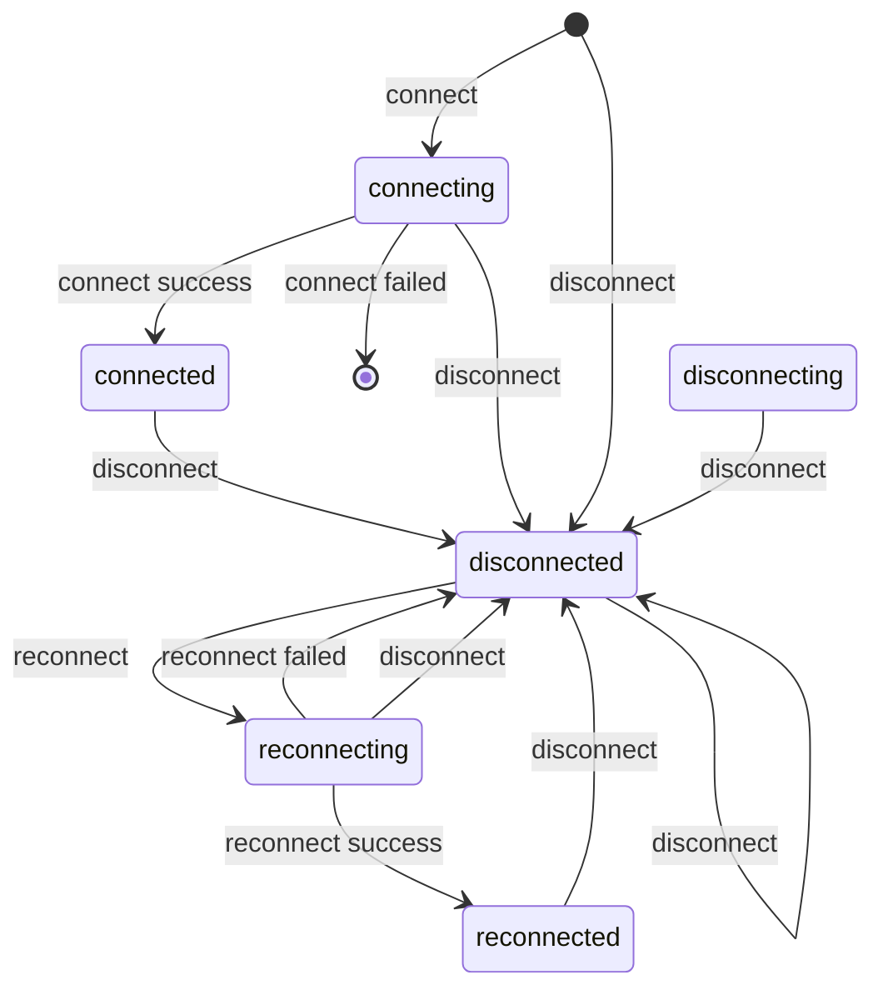

# 智能状态机

更加自动和简洁的实现状态的迁移。

# 安装 
  
  ```bash
  npm install -g afsm
  ```
# 使用

```ts

import { FSM,From,To } from 'afsm'

class MyFSM extends FSM {
  @From('')
  @To('state1')
  async gotoState1() {

  }
  @From('state1')
  @To('state2')
  async gotoState2() {

  }
}
const obj =  new MyFSM()
obj.gotoState2()//will throw error
obj.gotoState1().then(()=>{//will change to state1
  return obj.gotoState2()//then change to state2
})

```
每一种状态变更时，都会进入变更中的状态，当异步函数返回后才会使得状态变更成功，同时发出事件。
```ts
const obj =  new MyFSM()
obj.on('state2',(oldState) => {
  console.log(obj,'is state2 now')
})
```

# 内置原子状态机
  
```ts
import { AFSM } from 'afsm'
const afsm = new AFSM()
afsm.start().then(() => {
  //do something after start
  return afsm.stop()
}).then(()=>{
  //do something after stop
})
```
原子状态机有两种基本状态，即ON和OFF。可以用原子状态机组合成复杂的状态。
在start和stop中间是异步变更中的状态，所以一共有4种状态。

