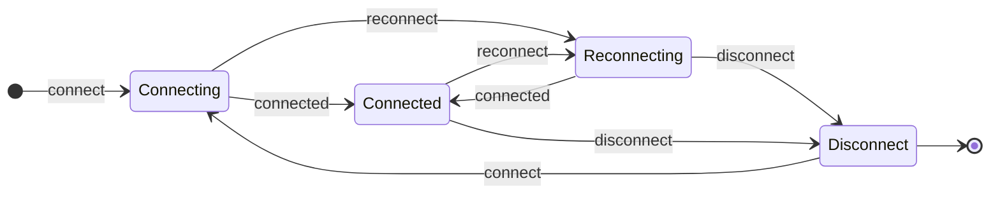
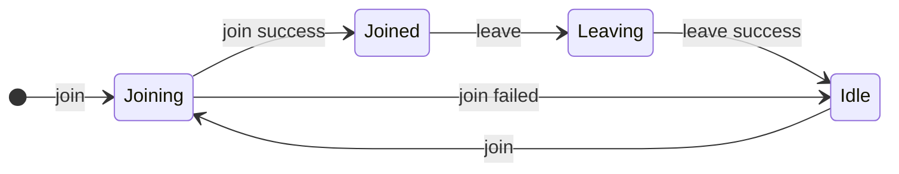
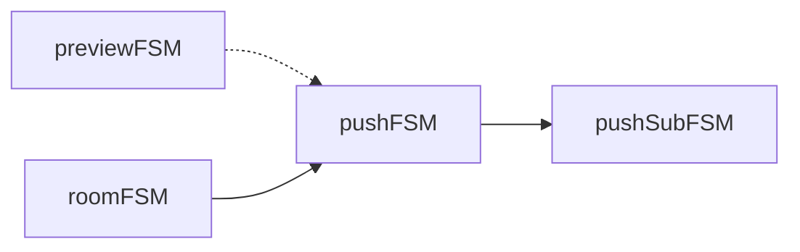

# AFSM——原子状态机

> FSM是有限状态自动机（Finite State Machine）的缩写
> **原子状态机**（Atom FSM） 简称AFSM，代表基本状态机

# 原子状态机介绍
## Q： 开发中遇到了什么痛点？
A：当我们开发SDK时，需要处理API乱序调用，以及资源正确释放两大问题，这两大问题使得程序变得十分复杂难以维护。
## Q：如何解决？
A：引入FSM解决乱序调用问题，引入Context模型解决资源释放问题。
## Q：是否会带来更多的成本？
A：会。状态越多使用FSM的收益越大，但是大量的对象状态并不多，Context模型没有实现规范，目前代码不容易被理解。
## Q：有没有更好的方案？
A：有，就是本文要讲的内容：原子状态机AFSM，将FSM分解为基本状态机，并且通过组合关联实现Context模型。
## Q：使用AFSM有哪些好处？
A：学习成本低，没有复杂的概念，显著降低代码复杂度，可以非常方便监控所有AFSM的状态。

# FSM与AFSM
当我们引入FSM的时候，我们假定一个对象有很多个状态，以连接后台的Connection对象为例，可能有disconnected、connecting、reconnecting、connected状态，我们利用FSM可以很容易在多个状态间正确的流转,例如：

再比如进房逻辑：

这意味我们需要为每一种逻辑单独编写FSM，没有复用性，也很难让这些状态机之间产生“量子纠缠”（关联性）。
我们必须简化FSM模型，使得万物都可以用同一种FSM描述。
**犹如四种基本力（或者两仪生四象、四个方向、四个季节、四冲程内燃机）一样，我们可以将FSM简化为四种状态的基本FSM——AFSM。**


> 对于只包含3种状态或者2种状态的对象也可以统一成4种状态，比如启动同步成功，或者停止也是同步成功，仍然可以经历4种状态，只是连续变化一下即可。为何要统一成4状态？这样就可以在组合这些AFSM时做一些抽象的封装，产生级联效果。

当然使用AFSM的时候有一个改变也悄然发生了，就是用组合代替继承，AFSM更具有原子性，即AFSM是简单对象，可以大量创建互相组合使用。

# Context级联取消
级联取消类似核裂变的链式反应。

就是父对象销毁时能触发子对象的销毁。那么为什么不直接在父对象销毁时手动去逐个销毁子对象呢？
>  ⚠️注意，上文中提到的父子对象不是**继承**关系，也不是**持有**关系，而是**生命周期**的依赖关系

原因之一是需要人工罗列销毁的对象，自动销毁是通过构建时确定的级联关系来执行，所以在任意地方构建的时候就已经决定了该对象何时会被销毁，减轻了销毁时的心智负担。原因之二是每一个对象都有状态，自动销毁可以自动判断状态做一些智能的操作，否则需要人工判断每一个对象的状态。这就是集中式处理：

``` 
// 父级生命周期结束
function onStop(){
	if(this.child1.running)this.child1.stop()
	if(this.child2.running)this.child2.stop()
}
// 传统写法需要罗列销毁的步骤存在状态判断等一系列操作，销毁和创建分离
```
如果采用Context模型，销毁操作会分布式处理：
``` 
// 父级生命周期结束
function onStop(){
	this.ctx.cancel()
}
// 采用Context模型，自动触发依赖关系的生命周期结束，销毁和创建是同一个地方的（这里没有显示）
```
这实际上是销毁逻辑的的前移，可以类比运行时和编译时的区别。
# AFSM级联

## 子级AFSM
所谓子级AFSM，就是在生命周期的角度看，只有父级AFSM处于running状态时才可以start的AFSM。例如启动推流必须是在已经成功进房以后才可以开始。实现这个逻辑很简单，在AFSM收到start命令后附带判断parent是否处于running状态即可。

``` 
start(...args: any[]) {
    return (!this.parent || this.parent.running) && this.transition(FSM_EVENT.START, ...args);
}
```

## 级联stop
所谓的级联stop，就是为了实现级联Context取消能力，当父对象触发stop事件后，就调用子对象stop命令：

``` 
parent.on(FSM_EVENT.STOP, () => this.stop());
```
用一个形象的比喻来解释上述**两种**逻辑：

最左边是总开关，而右边一排都是子级开关
- 当总开关打开后，右侧的开关才起作用
- 当总开关关闭，等于右侧所有开关都关闭

这很好理解，值得一提的是，和平时运行时判断状态不同，这种级联的安排是提前设计好的，也就是说有一种强约束力，从代码角度来说就是被抽象出来在框架里面执行了。
## 用AFSM代替（分解）普通FSM的例子
我们以视频预览（采集+本地播放）、视频推流、视频推辅流为例子说明（已简化）：

- 视频预览可在进房前打开
- 进房后打开视频预览或者打开视频预览后进房会自动推流
- 如果推流过程中视频关闭预览，则自动停止推流
- 视频推流过程中可以开启辅流推流
- 停止推流时也自动停止辅流的推流

传统开发时，需要在每一种操作时进行状态判断，如果状态变多，则会非常复杂。那么我们可以针对每一种生命周期创建一个AFSM来管理，并根据依赖关系赋予父子关系。


虚线代表是不是父子关系，但是previewFSM的stop会导致pushFSM的stop。
当我们建立好这些AFSM的依赖关系后，就只需要在需要执行动作的时候，调用对应的AFSM的start方法。
然后我们的程序就监听这些AFSM对象的事件，开启或者停止就执行对应的逻辑，需要判断当前状态。反复调用start或者stop都不会引起错误，所有状态都会自动保持一直正确。# AFSM通用功能
就是封装在基类中的方法和事件，用于使用AFSM对象。
## 状态变更
- start 将尝试从idle切换到starting
- startSuccess 将尝试从starting切换到running
- startFailed 将尝试从staring切换到idle
- stop 将尝试从running切换到stopping
- stopSuccess 将尝试从stopping切换到idle
- stopFailed 将尝试从stopping切换到running

所有方法均可以带入参数，将在成功流转状态后触发事件带出，方法返回true表示切换成功，false表示切换失败。例如，调用start后切换到了starting状态,此时再调动start就无效了，返回false。
## 当前状态
最常见的是判断当前AFSM对象是否处于running状态。
## 发出事件
每当状态成功流转，就会发出事件，例如startSuccess如果调用成功，这个对象就会发出startSuccess事件。
通过监听AFSM对象的事件就可以去处理对应的业务逻辑了。如果配合ReactiveX，就能更优雅的处理业务逻辑。
# AFSM监控能力
在AFSM的基类中，可以在构造函数里面收集对象，并在控制台暴露方法，将所有收集到的对象的状态打印出来。程序运行的状态细节就一目了然了。