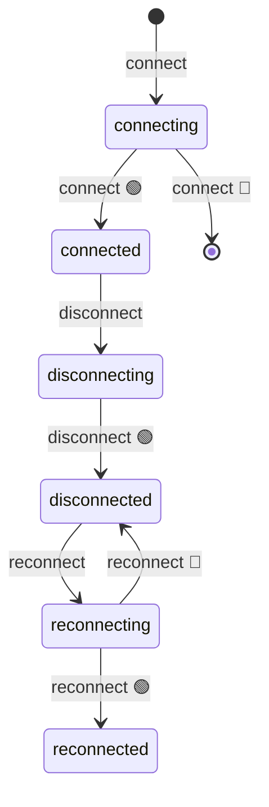

import EmbeddedPlayground from '../../../../components/EmbeddedPlayground.tsx';

Simulates a network connection: after `connect` succeeds the state becomes `connected`; `disconnect` moves to `disconnected`; failures trigger automatic reconnect.

<EmbeddedPlayground client:only="react" example="connection" autoRun />

## State diagram

## Key points

- `@ChangeState(FSM.INIT, 'connected')` — connect from the initial state
- `@ChangeState([], 'disconnected')` — `from: []` allows disconnect from any state (force transition)
- `reconnectAfter` is scheduled inside `disconnect` and retries recursively on failure

## Param suggestions

- Lower **success rate** to watch failure rollbacks
- **reconnect delay** affects the retry cadence

## Source

Full source on [GitHub](https://github.com/langhuihui/afsm/blob/main/test/test.ts) (the original includes the `context`-based start/stop; this is a simplified version).
