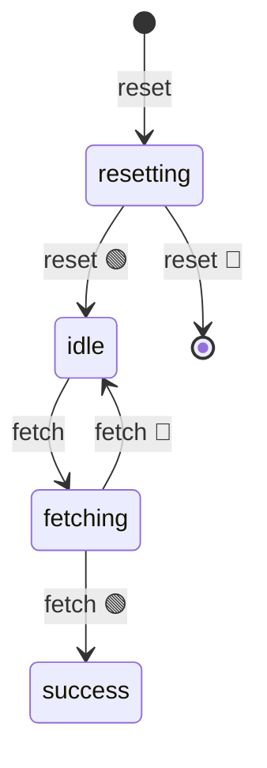

import EmbeddedPlayground from '../../../../components/EmbeddedPlayground.tsx';

Simulates a request with retry: `idle → fetching → success`, using `@ActionState` for the retry intermediate state.

<EmbeddedPlayground client:only="react" example="data-fetch" autoRun />

## State diagram

Note: `@ActionState('retrying')` does NOT appear in the diagram — it's a transient operation.

## Key points

- `@ChangeState('idle', 'success')` — the main request transition
- `@ActionState('retrying')` — transient state during retry-wait, returns to the original state after
- On failure, recurses with retry until `maxRetries` is hit

## @ActionState's role

During retry-wait, the state temporarily becomes `retrying` so the UI can show a "retrying" indicator; after the wait it auto-returns to the prior state. This avoids introducing a non-formal "retry-wait" node into the state diagram.

## Params

- **Fail rate** — observe retry behavior
- **Max retries** — cap the retry count

## Takeaway

`@ActionState` describes transient actions ("saving", "uploading", "retrying"), while `@ChangeState` describes formal state-machine nodes.
