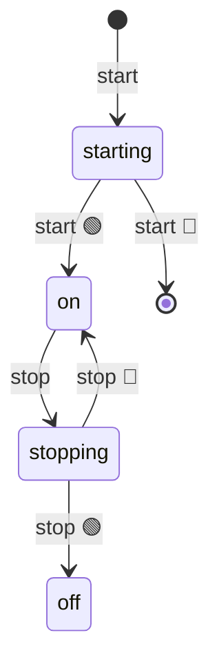

import EmbeddedPlayground from '../../../../components/EmbeddedPlayground.tsx';


Wraps the native `setInterval` as a state machine: stays in `ON` while emitting `interval` events.

<EmbeddedPlayground client:only="react" example="setinterval" autoRun />

## State diagram



## Key points

- `@ChangeState([FSM.INIT, FSM.OFF], FSM.ON)` — start
- `@ChangeState([], FSM.OFF)` — `stop()` from any state
- Emits `'interval'` events via `this.emit` for external listeners

## Usage

```ts
const t = new SetIntervalFSM('tick')
t.on('interval' as any, () => console.log('tick'))
await t.start(1000)
// ... later
await t.stop()
```

## Differences from the original

This example corresponds to `afsm/fsms/setInterval.ts`.
