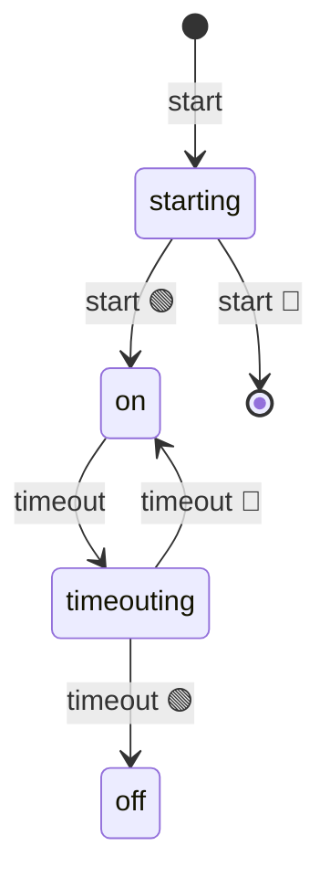

import EmbeddedPlayground from '../../../../components/EmbeddedPlayground.tsx';

Wraps the native `setTimeout` as a state machine: stays in `ON` while waiting, returns to `OFF` after firing.

<EmbeddedPlayground client:only="react" example="settimeout" autoRun />

## State diagram

## Key points

- `@ChangeState([FSM.INIT, FSM.OFF], FSM.ON)` — start from initial or off
- `@ChangeState(FSM.ON, FSM.OFF)` — timer fires, returns to OFF
- `@ChangeState([], FSM.INIT)` — `stop()` resets from any state

## Differences from the original

This example corresponds to `afsm/fsms/setTimeout.ts`; the original also provides a `reset(ms)` method (stop then start).
