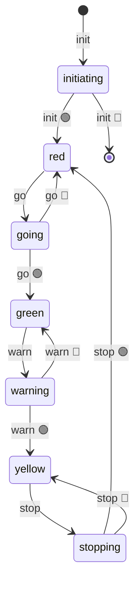

import EmbeddedPlayground from '../../../../components/EmbeddedPlayground.tsx';

A cyclic state machine: `red → green → yellow → red`. Great as an auto-demo on the home page.

<EmbeddedPlayground client:only="react" example="traffic-light" autoRun />

## State diagram

## Key points

- Each light change uses `@ChangeState`, auto-producing intermediate states (`goinging`, `warninging`, etc.)
- Timers schedule the next transition after entering a state
- The cycle is a closed loop: `go → warn → stop → go`

## Params

- **Green / Yellow / Red duration** — simulate different traffic configs

## Takeaway

The traffic light is a classic "cyclic state machine" — states form a closed loop with no terminal state. AFSM fully supports this structure.
