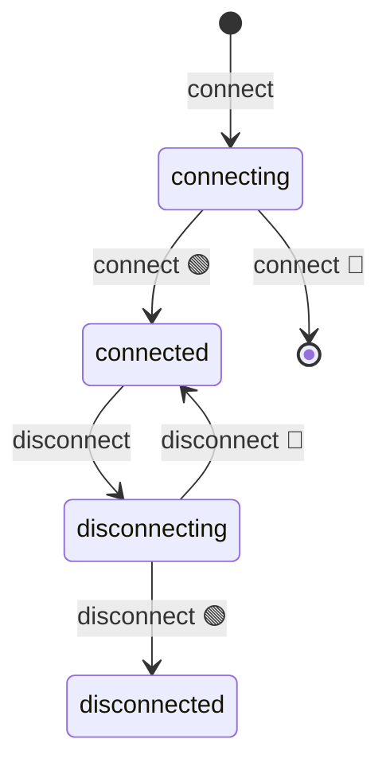

import EmbeddedPlayground from '../../../../components/EmbeddedPlayground.tsx';


AFSM auto-generates a mermaid state diagram — no manual writing needed.

## stateDiagram getter

```ts
const obj = new MyFSM()
console.log(obj.stateDiagram)
```

Returns an array of strings, each a line of mermaid `stateDiagram-v2` syntax:

```
[*] --> connecting : connect
connecting --> connected : connect 🟢
connecting --> [*] : connect 🔴
```

## Conventions

Each `@ChangeState(from, to)` generates three edges:

| Line | Meaning |
| --- | --- |
| `from --> actioning : action` | from start state into intermediate state |
| `actioning --> to : action 🟢` | success transition |
| `actioning --> from : action 🔴` | failure rollback |

- success marker
- failure marker
- `action` defaults to the method name, customizable via `opt.action`

## Rendering

Concatenate `stateDiagram` into full mermaid source to render:

```ts
const source = ['stateDiagram-v2', ...obj.stateDiagram].join('\n')
// feed source to mermaid
```

In markdown you can preview directly with a code block:



## from: [] special handling

`from: []` (any state) generates edges from all known states into the intermediate, reflecting "force transition" semantics:

```ts
@ChangeState([], 'disconnected')
async disconnect() {}
```

Generates:

```
connected --> disconnecting : disconnect
disconnecting --> disconnected : disconnect 🟢
connected --> disconnected : disconnect 🟢
...
```

## @ActionState is not in the diagram

Note: `@ActionState` does not register in `stateDiagram` — it's a transient operation, not a formal node. If you want a state to appear, use `@ChangeState`.

## Inheritance merging

Subclasses auto-merge the parent's diagram. Accessing `sub.stateDiagram` recursively merges parent edges and all states. See [Inheritance](../advanced/inheritance).

## Live observation with DevTools

With the [DevTools extension](../advanced/devtools), you can see the current state machine diagram live in the browser DevTools, with the current state marked.

The Playground on this site integrates the same visualization — try it live:

<EmbeddedPlayground client:only="react" example="data-fetch" autoRun />

## Next steps

- [API: FSM class](../api/fsm) — `stateDiagram` full definition
- [DevTools extension](../advanced/devtools) — install & usage
