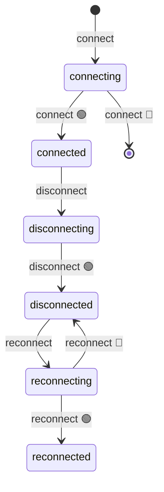

import EmbeddedPlayground from '../../../../components/EmbeddedPlayground.tsx';

模拟网络连接：`connect` 成功后进入 `connected`，`disconnect` 进入 `disconnected`，失败时自动重连。

<EmbeddedPlayground client:only="react" example="connection" autoRun />

## 状态图

## 关键点

- `@ChangeState(FSM.INIT, 'connected')` — 从初始状态连接
- `@ChangeState([], 'disconnected')` — `from: []` 表示任意状态都可断开（强制迁移）
- `reconnectAfter` 在 `disconnect` 内部调度，失败时递归重试

## 调参建议

- **成功率** 调低观察失败回滚
- **重连延迟** 影响失败后的重试节奏

## 源码

完整源码见 [GitHub](https://github.com/langhuihui/afsm/blob/main/test/test.ts)（原始版本含 `context` 组合的 start/stop，此处为简化版）。
