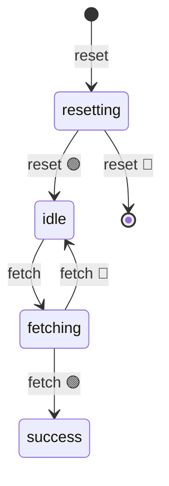

import EmbeddedPlayground from '../../../../components/EmbeddedPlayground.tsx';

模拟带重试的数据请求：`idle → fetching → success`，失败时用 `@ActionState` 体现重试中间态。

<EmbeddedPlayground client:only="react" example="data-fetch" autoRun />

## 状态图

注意：`@ActionState('retrying')` 不会出现在状态图里——它是瞬态操作。

## 关键点

- `@ChangeState('idle', 'success')` — 主请求迁移
- `@ActionState('retrying')` — 重试等待期间的瞬态状态，结束后回到原状态
- 失败时递归重试，直到达到 `maxRetries`

## @ActionState 的作用

重试等待期间，状态会临时变成 `retrying`，让 UI 可以显示「重试中」指示；等待结束后自动回到原状态（`idle` 或 `success` 之前的状态）。这避免了在状态图里引入「重试等待」这种非正式节点。

## 调参

- **失败率** — 观察重试行为
- **最大重试次数** — 控制重试上限

## 启示

`@ActionState` 适合描述「保存中」「上传中」「重试中」这类瞬态动作，而 `@ChangeState` 描述状态机的正式节点。
