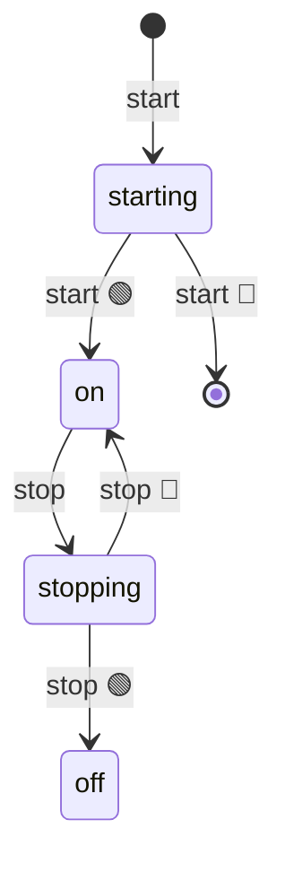

import EmbeddedPlayground from '../../../../components/EmbeddedPlayground.tsx';


把原生 `setInterval` 包装成状态机：`ON` 期间持续触发 `interval` 事件。

<EmbeddedPlayground client:only="react" example="setinterval" autoRun />

## 状态图



## 关键点

- `@ChangeState([FSM.INIT, FSM.OFF], FSM.ON)` — 启动
- `@ChangeState([], FSM.OFF)` — `stop()` 从任意状态停止
- 通过 `this.emit('interval')` 派发事件，外部监听即可

## 使用

```ts
const t = new SetIntervalFSM('tick')
t.on('interval' as any, () => console.log('tick'))
await t.start(1000)
// ... 稍后
await t.stop()
```

## 与原版差异

本示例对应 `afsm/fsms/setInterval.ts`。
