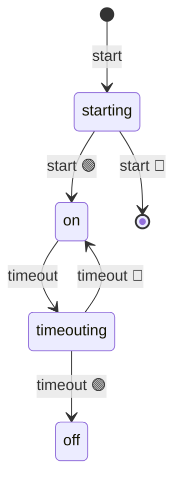

import EmbeddedPlayground from '../../../../components/EmbeddedPlayground.tsx';

把原生 `setTimeout` 包装成状态机：`ON` 期间等待，触发后回到 `OFF`。

<EmbeddedPlayground client:only="react" example="settimeout" autoRun />

## 状态图

## 关键点

- `@ChangeState([FSM.INIT, FSM.OFF], FSM.ON)` — 从初始或关闭状态启动
- `@ChangeState(FSM.ON, FSM.OFF)` — 定时器触发后回到 OFF
- `@ChangeState([], FSM.INIT)` — `stop()` 从任意状态重置

## 与原版差异

本示例对应 `afsm/fsms/setTimeout.ts`，原版还提供 `reset(ms)` 方法（先 stop 再 start）。
