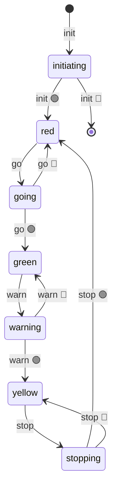

import EmbeddedPlayground from '../../../../components/EmbeddedPlayground.tsx';

一个循环状态机：`red → green → yellow → red`。适合作为首页自动演示。

<EmbeddedPlayground client:only="react" example="traffic-light" autoRun />

## 状态图

## 关键点

- 每个灯色切换都用 `@ChangeState`，自动产生中间态（`goinging`、`warninging` 等）
- 定时器在状态进入后调度下一次切换
- 循环结构通过 `go → warn → stop → go` 闭环

## 调参

- **绿灯时长** / **黄灯时长** / **红灯时长** — 模拟不同交通配置

## 启示

红绿灯是「循环状态机」的经典例子——状态之间形成闭环，没有终止态。AFSM 完全支持这种结构。
