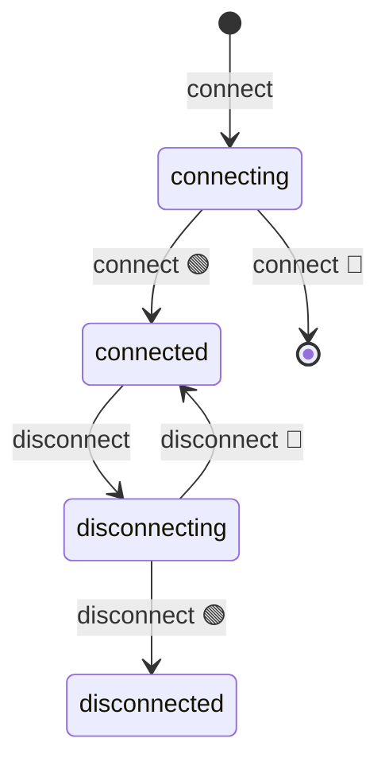

import EmbeddedPlayground from '../../../../components/EmbeddedPlayground.tsx';


AFSM 内置 mermaid 状态图自动生成，无需手写。

## stateDiagram getter

```ts
const obj = new MyFSM()
console.log(obj.stateDiagram)
```

返回一个字符串数组，每个元素是一行 mermaid `stateDiagram-v2` 语法：

```
[*] --> connecting : connect
connecting --> connected : connect 🟢
connecting --> [*] : connect 🔴
```

## 含义约定

每条 `@ChangeState(from, to)` 会生成三条边：

| 行 | 含义 |
| --- | --- |
| `from --> actioning : action` | 从起始状态进入中间态 |
| `actioning --> to : action 🟢` | 成功迁移 |
| `actioning --> from : action 🔴` | 失败回滚 |

- 成功标记
- 失败标记
- `action` 默认为方法名，可通过 `opt.action` 自定义

## 渲染状态图

把 `stateDiagram` 拼接成完整的 mermaid 源码即可渲染：

```ts
const source = ['stateDiagram-v2', ...obj.stateDiagram].join('\n')
// 把 source 喂给 mermaid 渲染
```

在 markdown 里可以用代码块直接预览：



## from: [] 的特殊处理

`from: []`（任意状态）会生成从所有已知状态到中间态的边，体现「强制迁移」语义：

```ts
@ChangeState([], 'disconnected')
async disconnect() {}
```

会生成：

```
connected --> disconnecting : disconnect
disconnecting --> disconnected : disconnect 🟢
connected --> disconnected : disconnect 🟢
...
```

## @ActionState 不出现在图里

注意：`@ActionState` 不会注册到 `stateDiagram` 中——它是瞬态操作，不是状态机的正式节点。如果想体现某个状态，请用 `@ChangeState`。

## 继承时的合并

子类会自动继承父类的状态图。访问 `sub.stateDiagram` 时，会递归合并父类的边与所有状态。详见[继承](../advanced/inheritance)。

## DevTools 实时观察

配合 [DevTools 扩展](../advanced/devtools)，可以在浏览器开发者工具里实时看到当前状态机图，并标记当前状态。

本站点的 Playground 也集成了同样的可视化，可以在线体验：

<EmbeddedPlayground client:only="react" example="data-fetch" autoRun />

## 下一步

- [API: FSM 类](../api/fsm) — `stateDiagram` 完整定义
- [DevTools 扩展](../advanced/devtools) — 安装与使用
